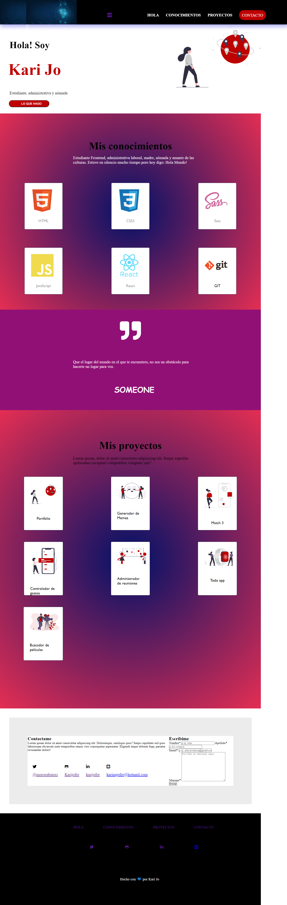

#Portafolio de Kari Jo

## Este proyecto está realizado para mostrar mi introducción personal y presentación de los proyectos que fui haciendo a lo largo del del Modulo 1 del curso Frontend de ADA y cualquier persona pueda acceder a ver los estilos, secciones,interacciones y efectos para una mejor experiencia de usuario.

***


## Si quiere ver como quedó mi proyecto, puedes dar clic al siguiente [enlace](https://karijofre.github.io/Portafolio-karijo/) o puedes hacerlo desde [acá](https://sad-swirles-a6aba2.netlify.app/)
<br>

***
## Si quieres tener el código en tu ordenador, deberás seguir los siguientes pasos en tu terminal.
***

- Ir al [repositorio](https://github.com/Karijofre/Portafolio-karijo)  
  - darle click al botón de forkear
  - Darle click al botón de code
  - Copiar la url
  - Abrir tu terminal y poner el comando de  ```git clone <url>```
  - Entrar a la carpeta del proyecto y abrirlo en tu IDE

## Este proyecto no necesita la instalación de ninguna dependencia, por ahora!

***

<br>

## Este debería ser el resultado final del proyecto instalado



***
## Este portafolio fue desarrollado para la cursada 6 de ADA. Agradezco a [Jonh](https://github.com/Jonhks) por la ayuda proporcionada.

***


#### De Kari Jo con ❤

